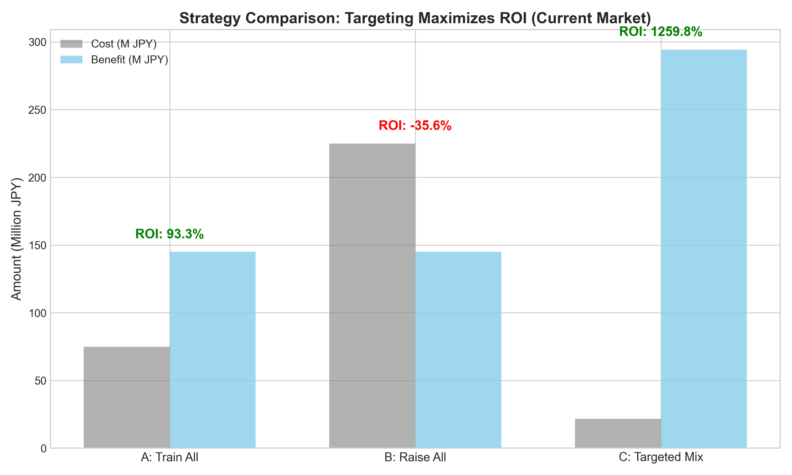
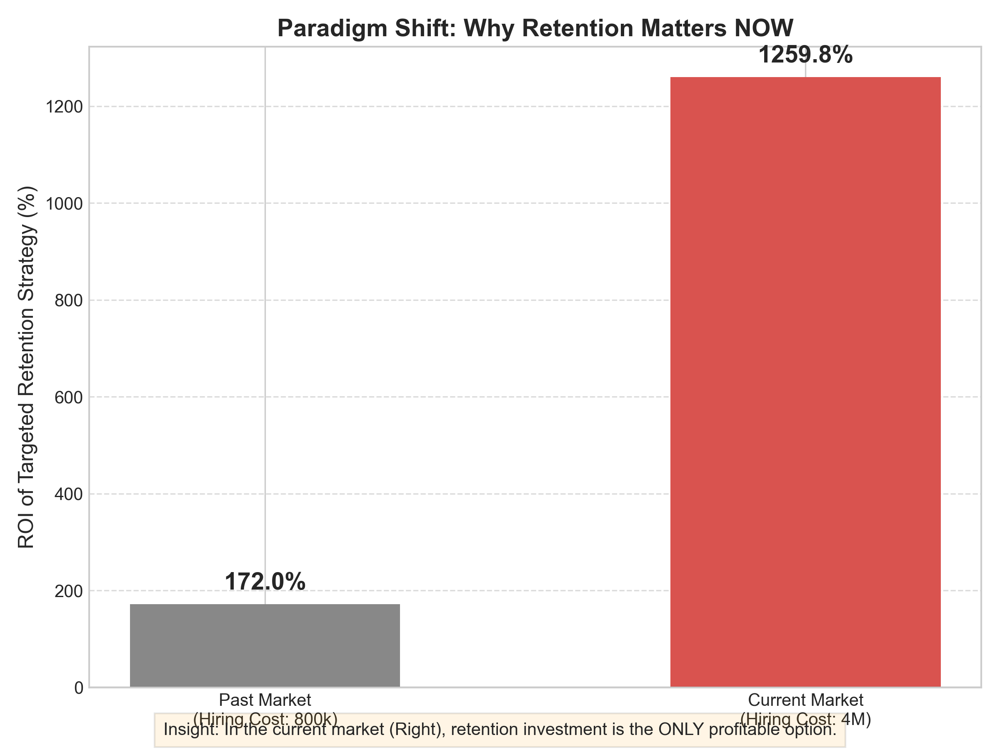

# 📊 Attrition Prediction & Causal Inference for HR Decision Making
**「誰が辞めるか」だけでなく、「どうすれば引き留められるか」を解明し、ROI 1200%超の施策を導き出すプロジェクト**


## 1. プロジェクト概要
多くの企業で「離職予測（誰が辞めそうか）」は行われていますが、そこから「誰に何をすればいいか」まで踏み込めているケースは稀です。
本プロジェクトでは、**予測モデル（Prediction）** に加えて **因果推論（Causal Inference）** を用いることで、人事施策の真の効果を検証し、**経営にとって最適な投資配分（Targeting）** をシミュレーションしました。

### 🔍 このプロジェクトが答える「3つの問い」
1. **Prediction (Who):** 誰が離職リスクが高いのか？
2. **Causal Inference (What works):** 研修や昇給は本当に離職防止に効くのか？
3. **Decision Making (So what):** 限られた予算を誰に投下すれば、ROI（投資対効果）が最大化するか？

---

## 2. 分析結果のハイライト（Executive Summary）

### 💡 主要な発見 (Key Insights)
* **離職構造:** 離職の最大要因は「燃え尽き（Burnout）」であり、給与額そのものよりも「給与改定（昇給体験）」が離職抑制に効くことが判明。
* **施策の異質性 (Heterogeneity):**
    * **研修:** 「20代の若手」には離職抑制効果が高いが、ベテラン層には効果が薄い。
    * **昇給:** 「ハイパフォーマー（評価4以上）」に対する昇給は、離職率を劇的に下げる（感度が高い）。

### 💰 経営インパクト (ROI Simulation)
施策を全員に一律で行うのではなく、因果推論に基づいて「効く人」にターゲットを絞ることで、**ROIは劇的に改善します。**



| 施策シナリオ | コスト | ベネフィット | ROI | 判定 |
| :--- | :--- | :--- | :--- | :--- |
| **A: 全員に研修** | 7,500万円 | 1.45億円 | **93.3%** | △ (悪くはないが無駄が多い) |
| **B: 全員に昇給** | 2.25億円 | 1.45億円 | **-35.6%** | ❌ (コスト過多で赤字) |
| **C: ターゲット特化** | 2,165万円 | 2.94億円 | **1,259.8%** | 🏆 **(圧倒的黒字)** |

> **結論:** データ分析に基づき「若手への研修」と「ハイパフォーマーへの昇給」を組み合わせる **Targeted Mix戦略** を採用することで、最小のコストで最大の利益保全が可能となる。

### 📉 なぜ今やるべきか？ (Paradigm Shift)
採用コストが高騰している現在の市場環境（1人あたり代替コスト400万円〜）においては、リテンション投資を行わないことが最大の経営リスクとなります。



---

## 3. 分析フローと技術スタック

### 🛠 使用ライブラリ
* **Data Processing:** `pandas`, `numpy`
* **Visualization:** `matplotlib`, `seaborn`
* **Machine Learning:** `scikit-learn`, `xgboost` (Ver 2.0.3)
* **Explainable AI:** `shap`
* **Causal Inference:** `econml`, `statsmodels`

### 📂 ディレクトリ構成
```bash
.
├── data
│   └── simulated_hr_data.csv   # シミュレーション生成された人事データ (n=1,500)
├── images                      # 生成された可視化グラフ
├── notebooks
│   ├── 01_EDA.ipynb              # 離職構造の可視化 (Attrition Curve等)
│   ├── 02_attrition_model.ipynb  # XGBoostによる予測とSHAPによる解釈
│   ├── 03_causal_inference.ipynb # 傾向スコア(PSM)とCausal Forestによる効果検証
│   ├── 04_heterogeneity.ipynb    # 「誰に効くか」の異質性分析 (CATE)
│   └── 05_business_decision.ipynb# 経営シミュレーションとROI算出
└── src
    └── data_generator.py       # データ生成用スクリプト